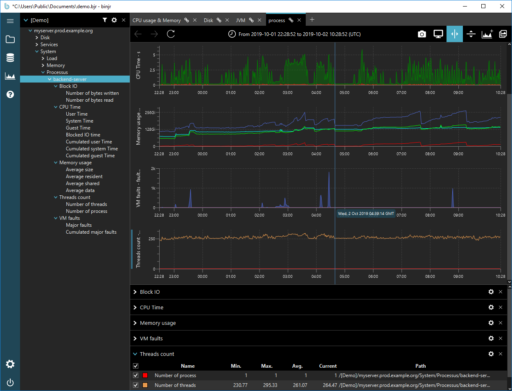

# binjr-adapter-demo
 

A plugin for binjr that provides data sources for demonstration purposes.

## Trying it out
1. Make sure [binjr](https://binjr.eu) is installed on your system (visit https://binjr.eu to get the latest release) 
   and make a note of the folder it is installed in.
2. Download the `binjr-adapter-demo-1.x.x.zip` archive.
3. Copy the `binjr-adapter-demo-1.x.x.jar` file contained in the zip file into the `plugins` folder of your 
   [binjr](https://binjr.eu) installation.
4. Start [binjr](https://binjr.eu) (or restart it if it was runnning when you copied the plugin) and open the `demo.bjr`
   workspace contained in the zip (from the command menu, select `Workspaces > Open...`, or press Ctrl+O) 

## Troubleshooting
* _"I get a `Could not find a registered adapter for key eu.binjr.sources.demo.adapters.DemoDataAdapter` error message when trying to open the demo.bjr workspace._  

   Please ensure that the `binjr-adapter-demo-1.x.x.jar` file is present in binjr's `plugins` folder and that is has been 
   properly loaded.  
   * From the settings panel, expend the `Data Adapter` section and check that the "Demo Data Adpater" is listed in 
   the Available Data Adpaters table.  
   * Consult the application's logs (located in `$TMPDIR/binjr` or  `%TEMP%\binjr`, or accessible via the debug console 
   by pressing `F12`) to see why the plugin failed to load.
   
* _"When I drop some tree nodes from the demo data source onto a new worksheet, I can see charts being created
 but all I see are flatlines ._  

   Please make sure the time interval defined for that new worksheet includes or intersects with a period going from the
    **3rd of July to the 7th of October 2019**, which is the period over which the data for the demo was recorded.  
    By default when creating a new worksheet, its default time range is set as the last 24 hours from the current time, 
    i.e. after the collection period. 
    
    